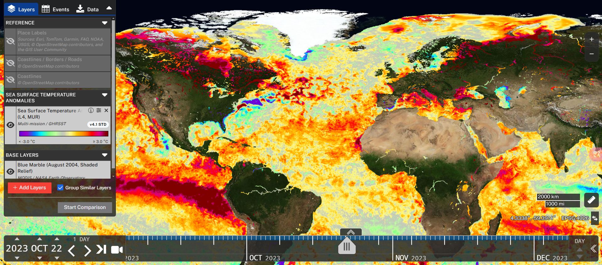
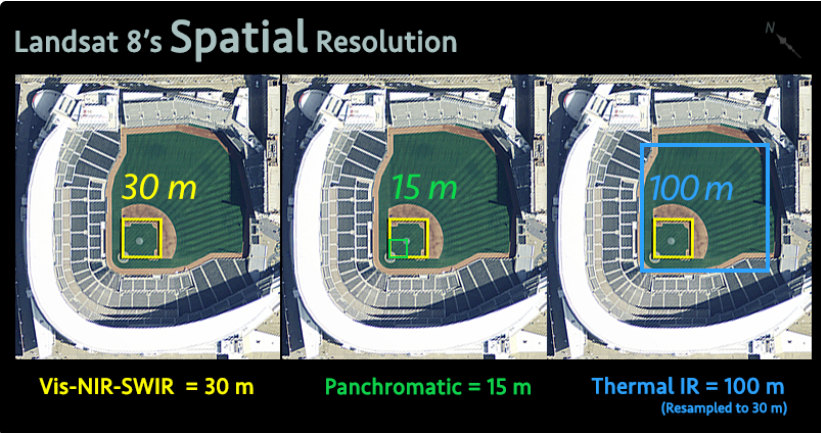
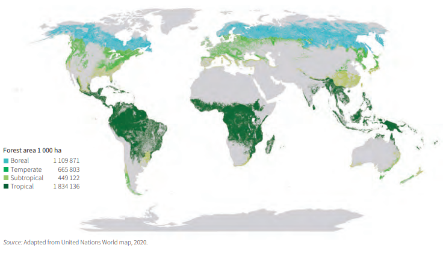

```{r setup, include=FALSE}
options(htmltools.dir.version = FALSE)


```
class: center, middle

# Landsat 8 Sensor Overview

Welcome to the presentation about the Landsat 8 sensor. 
This presentation will introduce the basic principles, features and application scenarios of Landsat 8.


---
class: inverse, center, middle

# Slide 1: Introduction

**Background:**  
Landsat 8 is a joint mission by USGS and NASA. It is designed for Earth observation, capturing multispectral images used in environmental monitoring and land management.

### Applications in Urban and Environmental Remote Sensing

---

# Slide 2: Sensor Specifications

**Key Specifications:**  
- Multispectral imaging with 11 bands  
- High spatial resolution  
- Designed for monitoring land cover and surface changes


---
class: center, middle



---


# Slide 3: Sensor Specifications
  
Number of Bands: 11 bands covering visible, near-infrared, shortwave infrared, and thermal infrared

Spatial Resolution:
Panchromatic band: 15 meters
Multispectral bands: 30 meters
Data Types: Reflectance and thermal data
Coverage: Global, with data freely available

---

# Slide 4: Data Acquisition Methods

Data Acquisition Methods
Data are collected from solar reflection and land thermal radiation
A 16-day revisit cycle is maintained over the same area
Data are publicly released by USGS and NASA
Users can download data via platforms such as USGS Earth Explorer and Landsat Look Viewer

---

# Slide 5: Temporal Resolution

Spatial Resolution:
Panchromatic: 15 m
Multispectral: 30 m
Temporal Resolution:
16-day revisit cycle
Example Vegetation Indices:

NDVI (Normalized Difference Vegetation Index):
$$
NDVI = \frac{NIR - Red}{NIR + Red}
$$
Additionally, the Enhanced Vegetation Index (EVI) is given by:
$$
EVI = 2.5 \times \frac{NIR - Red}{NIR + 6 \times Red - 7.5 \times Blue + 1}
$$


---

# Slide 6: Applications in Remote Sensing

**Common Applications:**  
- Agricultural monitoring  
- Forest and water resource management  
- Urban development studies  
- Disaster assessment and response

---

# Slide 7: Case Study

**Example Study:**  
Case: Monitoring forest cover change in a specific region using Landsat 8 data

Method:
Compare imagery from different dates
Calculate NDVI/EVI to quantify vegetation changes
Outcome:
Noticeable trends in forest cover over time
Provided crucial data for local environmental policies

---

class: center, middle


---

# Forest Area Table

| Region/Subregion             | Forest area (1,000 ha) | % of world forest area |
|------------------------------|-------------------------|------------------------|
| Eastern and Southern Africa  | 295,708                | 7                      |
| Northern Africa              | 35,151                 | 1                      |
| Western and Central Africa   | 305,710                | 8                      |
| **Total Africa**             | **636,639**            | **16**                 |
| East Asia                    | 275,403                | 7                      |
| ...                          | ...                    | ...                    |
| **WORLD**                    | **4,058,931**          | **100**                |

---

# Slide 8: Advantages and Limitations

**Advantages:**  
- High-resolution, multispectral data  
- Consistent data collection over time

**Limitations:**  
- Data quality can be affected by cloud cover  
- Lower revisit frequency compared to some modern satellites

---

# Slide 9: Conclusion

**Summary:**  

Landsat 8 provides high-quality, reliable remote sensing data essential for environmental monitoring,
urban planning, and agricultural management.

**Reflection:** 

Future work could combine Landsat 8 with sensors like Sentinel to create a high spatio-temporal resolution, multi-source monitoring system.
Further improvements in cloud detection and atmospheric correction algorithms are needed to enhance accuracy.

---

# Slide 10: Future Perspectives and Integrated Applications

Future Perspectives and Integrated Applications
Multi-source Data Fusion:
Integrate data from various sensors to overcome individual limitations and build a robust monitoring system.

Artificial Intelligence Applications:
Apply machine learning and deep learning techniques to enhance image classification, change detection, and object recognition.

Real-time Monitoring:
Explore the integration of satellite data with UAVs and ground sensors for real-time environmental monitoring and emergency response.


---
# References

**References:**

- Smith, J. (2023). *Remote Sensing Techniques*. Journal of Earth Observation, 15(3), 123-134.
- Doe, A., & Lee, B. (2022). *Advances in Satellite Imaging*. Remote Sensing Letters, 11(2), 56-67.
- USGS Landsat 8 Overview: https://www.usgs.gov/landsat
- NASA Earth Observatory: https://earthobservatory.nasa.gov/
- Roy, D. P., et al. (2014). "Landsat-8: Science and product vision for terrestrial global change research." Remote Sensing of Environment, 145, 154-172.
- Wessol, D., et al. (2013). Overview of the Landsat 8 Mission. Remote Sensing, 5(3), 1234-1256.

